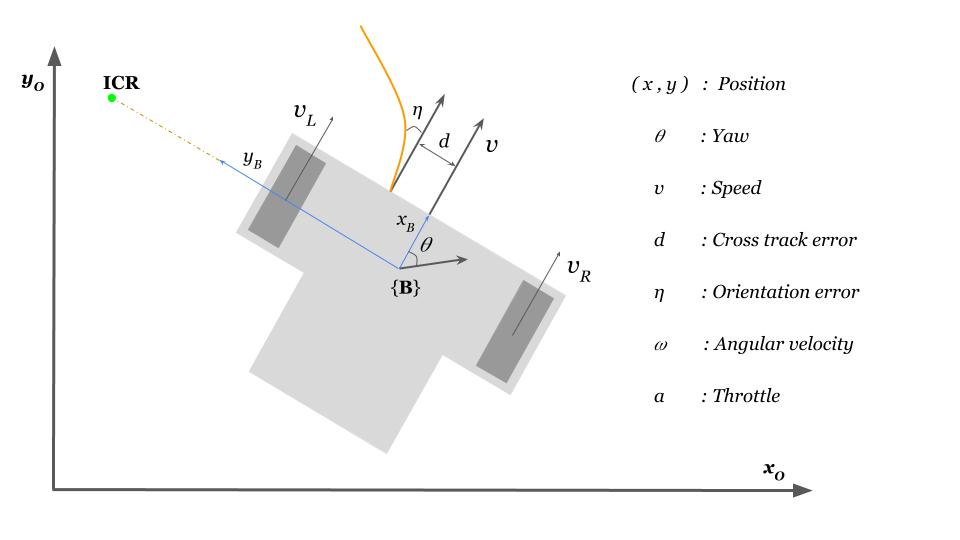
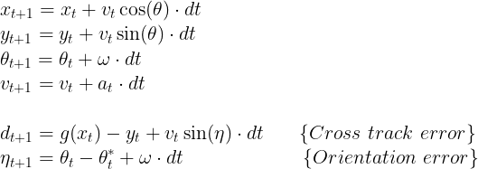
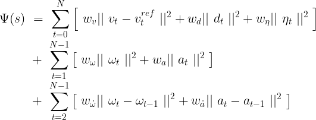

# mpc_lib

Main library for implementation of Model Predictive Control system.

## File system

```bash

mpc_lib
├── include
│   ├── cppad
│   ├── Eigen-3.3
│   ├── Ipopt-3.12.7
│   └── mpc_lib
│       └── MPC.h
└── src
    └── MPC.cpp
```

**cppad**

A C++ Algorithmic Differentiation package

**Eigen-3.3**

Eigen is a high-level C++ library of template headers for linear algebra, matrix and vector operations, geometrical transformations, numerical solvers and related algorithms.

**Ipopt-3.12.7**

IPOPT, short for "Interior Point OPTimizer, pronounced I-P-Opt", is a software library for large scale nonlinear optimization of continuous systems.

## Installation Instructions

- Install cppad

```bash
sudo apt-get install cppad
```

- Install IPOPT

Warnings maybe ignored.

```bash
sudo bash install_ipopt.sh ./include/Ipopt-3.12.7
```

## MPC Algorithm


**Setup** :

&nbsp;&nbsp;&nbsp;&nbsp;1. Define length of prediction horizon, _N_, and duration of each timestep, _dt_.

&nbsp;&nbsp;&nbsp;&nbsp;2. Define vehicle dynamics and actuator limitations along with other constraints.

&nbsp;&nbsp;&nbsp;&nbsp;3. Define cost function

**Loop** :

&nbsp;&nbsp;&nbsp;&nbsp;1. Pass current state as initial state to model predictive controller.

&nbsp;&nbsp;&nbsp;&nbsp;2. Call the optimization solver (we used _Ipopt_). It will return a vector of control inputs that minimizes the cost function.

&nbsp;&nbsp;&nbsp;&nbsp;3. Apply first control imput to vehicle.

&nbsp;&nbsp;&nbsp;&nbsp;4. Back to 1

### Plant Model



**Dynamics**



**Constraints**


**Cost function**



### MPC Preprocessing

**Preprocessing of setpoints is done in the main controller node**

The setpoints are passed to the controller with respect to an arbitrary global coordinate system by the path planning module. This is then transformed into the vehicle's **local coordinate system**.

```c++
for (int i = 0; i < ptsx.size(); i++)
{
    // translation
    double shift_x = ptsx[i] - px;
    double shift_y = ptsy[i] - py;
    // rotation
    ptsx[i] = shift_x * cos(-theta) - shift_y * sin(-theta);
    ptsy[i] = shift_x * sin(-theta) + shift_y * cos(-theta);
}
```

This is then used to get a 3rd order polynomial as an estimate of the current road curve ahead. Using a smaller order polynomial runs the risk of underfitting and likewise using a higher order polynomial would be prone to overfitting or an inefficient unnecessary added complexity.

[Function used to get fitted curve - GitHub](https://github.com/JuliaMath/Polynomials.jl/blob/master/src/Polynomials.jl#L676-L716)

The current **Cross track error** and **Orientation error** is calculated from the polynomial coefficients as follows:

```c++
double cte = coeffs[0];
double etheta = -atan(coeffs[1]);
```

## References

[Starter code : Udacity Model Predictive Control (MPC) Project](https://github.com/udacity/CarND-MPC-Project)

[Bouzoualegh, Samir & Guechi, Elhadi & Kelaiaia, Ridha. (2018). Model Predictive Control of a Differential-Drive Mobile Robot. Acta Universitatis Sapientiae Electrical and Mechanical Engineering. 10. 20-41. 10.2478/auseme-2018-0002.](https://www.researchgate.net/publication/330879789_Model_Predictive_Control_of_a_Differential-Drive_Mobile_Robot)
